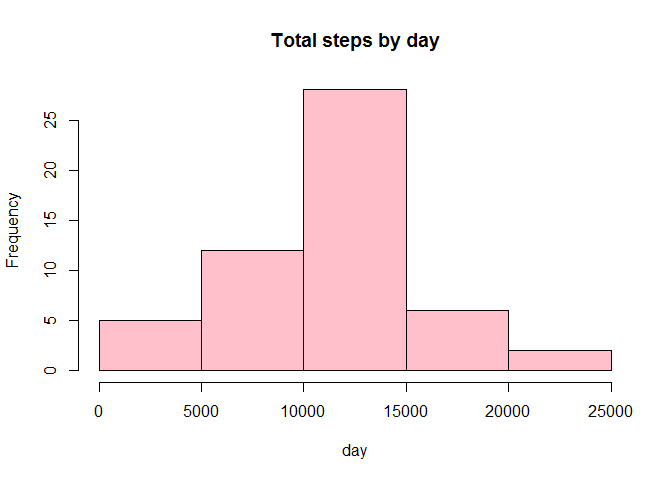
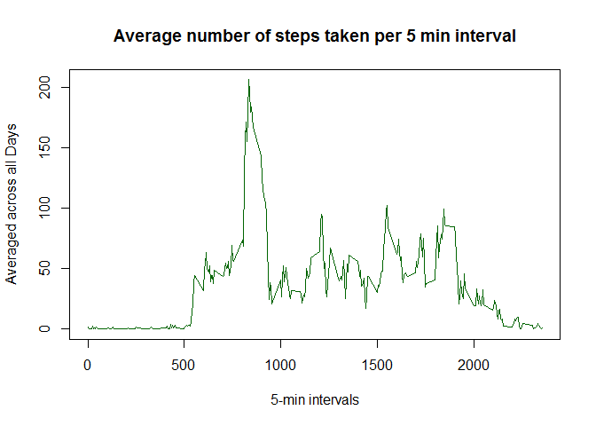
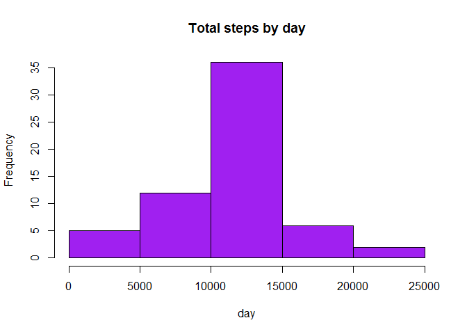
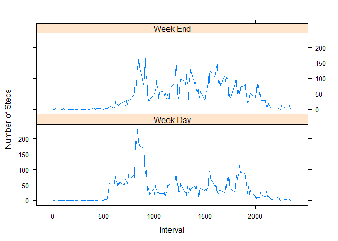

# Reproducible Research: Peer Assessment 1

# Reproducible Research

## Peer Assignment 1


```r
# get the library I will need for the xyplot at the end of this document
library(lattice)

# The assumption here is that you have loaded the activity.csv file into your working directory as I have.
activity <- read.csv("activity.csv")

activity$date <- as.Date(activity$date, "%Y-%m-%d")
aggregatedActivity <- aggregate(steps ~ date, 
                                data = activity, 
                                sum, 
                                na.rm = TRUE)
```


```r
activityMean <- format(round(mean(aggregatedActivity$steps),0), 
                       scientific=FALSE)
activityMedian <- median(aggregatedActivity$steps)
```

#### The mean of the data set is: **10766**. 

#### The median of the data set is: **10765**.

### **The Historgram that is aggregated by day**

```r
hist(aggregatedActivity$steps, 
     main = "Total steps by day", 
     xlab = "day", 
     col = "pink")
```

 

### **What is the average daily activity pattern?**
### To answer that question, this is my Time series averaged accross all intervals for the duration

```r
timeSeries <- tapply(activity$steps, 
                     activity$interval,
                     mean,
                     na.rm=TRUE)
plot(row.names(timeSeries), 
     timeSeries, 
     type = "l", 
     xlab = "5-min intervals", 
     ylab = "Averaged across all Days", 
     main = "Average number of steps taken per 5 min interval", 
     col = "dark green")
```

 


```r
intervalForMaxSteps <- names(which.max(timeSeries))
maxNumberOfSteps <- round(timeSeries[[which.max(timeSeries)]],0)
```

### The interval with the maximum number of steps on average is **835** and they took and average of **206** steps during that interval.

#### **Inputting missing values**
#### The following code shows how I calculate the number of NA (unknown) values:

```r
NAvalues <- sum(is.na(activity))
```
### The number of NA values (null/unknown) in this dataset is: **2304**.

### This is how I replace all the missing values with the mean of the inteval it belongs to.
### I then display the historgram built from this data set with the replacement values.


```r
#
# First get the average steps per interval
# I will use this average to fill in for the missing values
# as I step trough the data
#
averageSteps <- aggregate(steps ~ interval, 
                         data = activity, 
                         mean)

replacementSteps <- numeric()
for (i in 1:nrow(activity)) {
  temp <- activity[i, ]
  if (is.na(temp$steps)) {
    steps <- subset(averageSteps, interval == temp$interval)$steps
  } else {
    steps <- temp$steps
  }
  replacementSteps <- c(replacementSteps, steps)
}

# Rebuild the dataset from the original replacing the steps with the replacements I just created with no NA values
newActivity <- activity
newActivity$steps <- replacementSteps


# Make a histogram of the total number of steps taken each day
aggregatedActivity2 <- aggregate(steps ~ date, 
                                 data = newActivity, 
                                 sum, 
                                 na.rm = TRUE)


# Build the histogram
hist(aggregatedActivity2$steps, 
     main = "Total steps by day", 
     xlab = "day", 
     col = "purple")
```

 

#### This is how I calculate the mean and median for the new dataset

```r
activityMean2 <- format(round(mean(aggregatedActivity2$steps),0), 
                       scientific=FALSE)
activityMedian2 <- format(round(median(aggregatedActivity2$steps),0),
                          scientific=FALSE)
```


#### The mean of the new data set is: **10766** compared to **10766** from the original (**the same**). 

#### The median of the new data set is: **10766** compared to **10765** from the original (**marginally higher**).

#### Are there differences in activity patterns between weekdays and weekends? **Yes**, the weekend has **more** consistent steps taken over more time.

#### For this part the weekdays() function may be of some help here. Use the dataset with the filled-in missing values for this part.

#### This is how I create a new factor variable in the dataset with two categories for week days and week ends.

```r
# I like this weekdays function... very easy to use...
#
day <- weekdays(newActivity$date)
category <- vector()
for (i in 1:nrow(newActivity)) {
  if (day[i] == "Saturday") {
    category[i] <- "Week End"
  } else if (day[i] == "Sunday") {
    category[i] <- "Week End"
  } else {
    category[i] <- "Week Day"
  }
}
newActivity$category <- category
newActivity$category <- factor(newActivity$category)

stepsByDay <- aggregate(steps ~ interval + category, 
                        data = newActivity, 
                        mean)
names(stepsByDay) <- c("interval", "category", "steps")


#### Make a panel plot containing a time series plot (i.e. type = "l") of the 5-minute interval (x-axis) and the average number of steps taken, averaged across all weekday days or weekend days (y-axis):
  xyplot(steps ~ interval | category, 
         stepsByDay, 
         type = "l", 
         layout = c(1, 2), 
         xlab = "Interval", 
         ylab = "Number of Steps")
```

 
